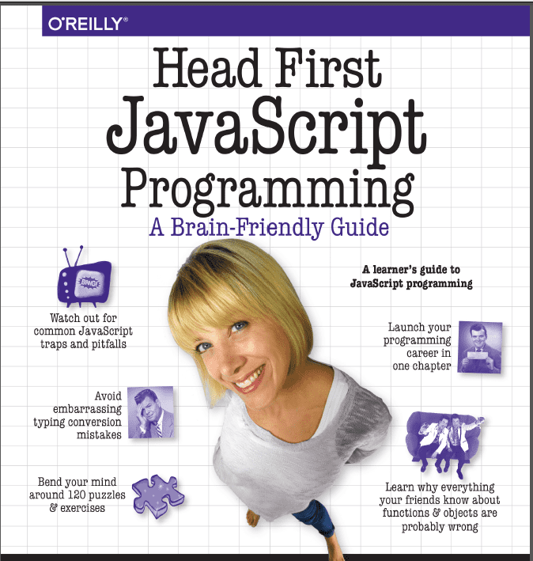

# JAVASCRIPT FUNCTIONS
Learning and Practicing some javascript functions from Head First Javascript Programming (https://www.wickedlysmart.com/hfjs/)

## PREREQUISITES
To test these javascript functions you need a web browser.

## RUNNING THE TESTS
You can copy the links below and paste into the address/search column for example of 
* Sort method function: (file:///C:/Users/HP/Documents/version-control/JS-functions/Sort-method.html)
* How to create,use and work a constructor function:
  (file:///C:/Users/HP/Documents/version-control/JS-functions/constructors.html) 
* How to make use of an object literals(Reworking car constructor): 
  (file:///C:/Users/HP/Documents/version-control/JS-functions/carConstructor.html)
* Using a **typeof** operator to identify an object:
  (file:///C:/Users/HP/Documents/version-control/JS-functions/Car&DogConstructor.html)
* Creating,inheriting,extending and testing prototypes,Understanding Object Instances:
  (file:///C:/Users/HP/Documents/version-control/JS-functions/dog-prototype.html)
* overriding the prototype,using **hasOwnPropety**
  (file:///c:/Users/HP/Documents/version-control/JS-functions/robotgame.html)
* Creating and testing Closure function: (file:///c:/Users/HP/Documents/version-control/JS-functions/divClosure.html) 
  
  ## BUILT WITH
  visual studio code.
  
  ### VERSIONING
  I use git for versioning.
  
  
